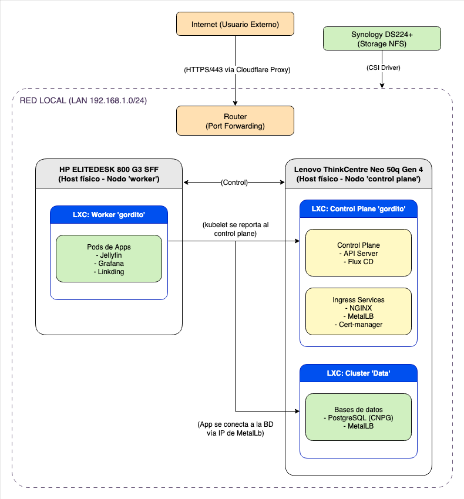

# Homelab: Plataforma Multi-Clúster con Kubernetes y GitOps

## Introducción

Este repositorio es la fuente única de la verdad para toda la infraestructura que corre en mis servidores personales. Utilizando un enfoque **GitOps** con **Flux CD**, toda la configuración de los clústeres Kubernetes —incluyendo servicios del sistema, aplicaciones de usuario final y operadores— se gestiona de forma completamente declarativa y automatizada.

El propósito de este proyecto es demostrar mis competencias en prácticas modernas de ingeniería de infraestructura, incluyendo automatización, aprovisionamiento inmutable, gestión declarativa, monitoreo, seguridad y alta disponibilidad..

---

## Arquitectura

La infraestructura está diseñada bajo un enfoque **multi-clúster**, con separación de cargas de trabajo según su tipo (con estado vs. sin estado), lo que permite escalar, actualizar y mantener de forma independiente cada dominio funcional.

| Clúster   | Nodos                                                   | Propósito                                                                      |
| :-------- | :------------------------------------------------------ | :----------------------------------------------------------------------------- |
| `gordito` | 1x Control Plane (Lenovo Neo 50q), 1x Worker (HP EliteDesk) | Corre aplicaciones de usuario final como Jellyfin, Grafana y Linkding.         |
| `data`    | 1x Control Plane (Lenovo Neo 50q)                       | Maneja únicamente bases de datos y servicios con estado como PostgreSQL.       |

### Diagrama de Arquitectura

> Este diagrama ilustra cómo se interconectan los hosts físicos, los contenedores LXC, el almacenamiento (NAS Synology) y los servicios de red.

---

## Hardware

| Modelo                      | CPU                        | Rol                                      |
| :-------------------------- | :------------------------- | :--------------------------------------- |
| Lenovo ThinkCentre neo 50q  | Intel Core i5-13420H       | Host Principal (Control Planes y Datos)  |
| HP EliteDesk 800 G3 SFF     | Intel Core i7-6700         | Host Secundario (Nodo Worker de Apps)    |
| Synology DS224+             | N/A                        | Almacenamiento Persistente (NFS)         |

---

## Sistema Operativo de los Nodos

Todos los LXC que corren los clústeres (`gordito`, `data`) utilizan **NixOS**, lo que permite:

- Gestión completamente declarativa de paquetes, servicios y configuraciones.
- Reproducibilidad exacta entre nodos y entornos.
- Facilidad para actualizar y versionar la infraestructura a través de repositorios Git.

Esto incluye tanto los nodos de control como los workers, garantizando que **todo el stack** desde el SO hasta las aplicaciones en contenedores está bajo control declarativo.

---

## Stack Tecnológico

| Categoría        | Herramienta                                  | Descripción                                                               |
| :--------------- | :------------------------------------------- | :------------------------------------------------------------------------ |
| **Orquestación** | Kubernetes (k3s)                             | Orquesta y gestiona todas las cargas de trabajo en contenedores.          |
| **GitOps** | Flux CD                                      | Mantiene la sincronización constante y automática entre Git y los clústeres. |
| **Virtualización** | Proxmox (LXC)                                | Capa de virtualización ligera para contenerización de los nodos del clúster. |
| **Redes** | MetalLB, NGINX Ingress, ExternalDNS, **DDNS-Updater** | Pila completa para asignación de IPs locales, enrutamiento y DNS dinámico público. |
| **Seguridad** | Cert-Manager, External Secrets + Infisical   | Emisión automática de certificados TLS y gestión segura de secretos externos. |
| **Datos** | CloudNativePG, Synology CSI                  | Gestión experta de PostgreSQL y provisión de almacenamiento persistente. |
| **Observabilidad** | kube-prometheus-stack                        | Incluye Prometheus y Grafana para la recolección y visualización de métricas. |

---

## Aplicaciones Desplegadas

A continuación, una lista representativa (en expansión) de las aplicaciones desplegadas actualmente en el clúster `gordito`, gestionadas mediante manifiestos GitOps:

| Aplicación    | Descripción                                        | Expuesta Externamente |
| :------------ | :------------------------------------------------- | :--------------------- |
| Jellyfin      | Servidor multimedia para streaming personal        | Sí                     |
| Linkding      | Gestor de marcadores minimalista                   | Sí                     |
| Grafana       | Paneles de monitoreo y visualización               | Sí                     |
| Memos         | Notas y gestión de ideas personales                | Sí                     |

> Esta tabla crecerá a medida que se integren nuevos servicios (automatización, backups, dashboards, etc.).

---

## Características Destacadas

- **Enfoque Multi-Clúster**: Separación de responsabilidades entre datos y aplicaciones para máxima resiliencia.
- **Gestión Declarativa Total**: Toda la infraestructura es reproducible desde cero a partir de este repositorio de Git.
- **Red y DNS Completamente Automatizados**: Descubrimiento de servicios internos y actualización de la IP pública sin intervención manual.
- **Seguridad por Diseño**: Cero credenciales en Git, TLS con Let's Encrypt para todos los servicios expuestos.
- **Transcodificación por GPU**: Passthrough de iGPU configurado en Proxmox para acelerar por hardware las cargas de trabajo de video en Jellyfin.
- **Monitoreo Avanzado**: Pila completa de métricas y dashboards en Grafana para una visibilidad total del sistema.

---

## Próximos Pasos

- Integrar una solución centralizada de logging (**Loki + Promtail**).
- Configurar backups automatizados para PostgreSQL con las herramientas de CloudNativePG o **Velero**.
- Implementar automatización de versiones de imágenes Docker con **Flux Image Automation**.

---

*Este repositorio es una representación práctica de mis habilidades técnicas y forma parte de mi portfolio profesional.*
